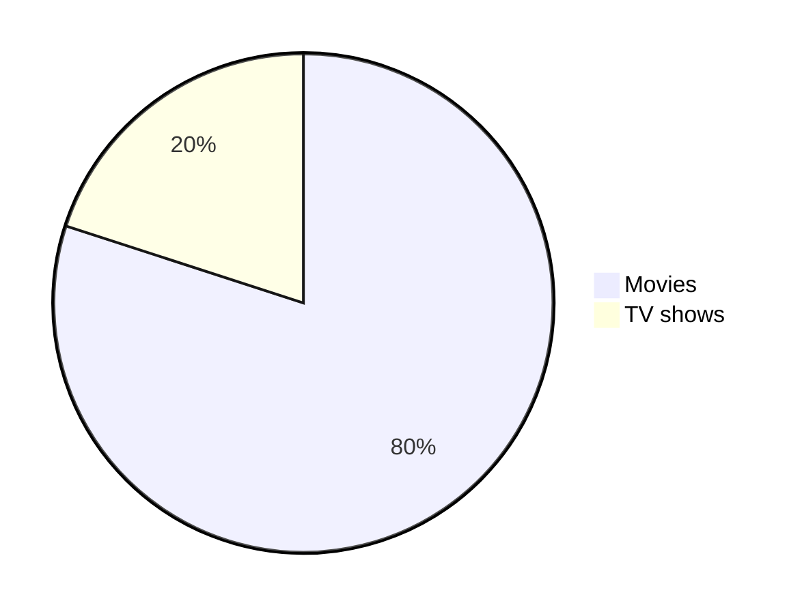

<p align="center">✨Dvurechensky✨</p>

<p align="center">
    <a href="https://git.io/typing-svg"></a>
</p>
<p align="center">
    <a href="https://sites.google.com/view/dvurechensky" target="_blank"></a>
</p>

# Поддерживаемые расширения файлов 🌊 в Markdown для Gitea | Github

- [Поддерживаемые расширения файлов 🌊 в Markdown для Gitea | Github](#поддерживаемые-расширения-файлов--в-markdown-для-gitea--github)
  - [Таблица сравнения 🌀](#таблица-сравнения-)
  - [mermaid ⛄](#mermaid-)
  - [geoJSON ⛄](#geojson-)
  - [topoJSON ⛄](#topojson-)
  - [STL ⛄](#stl-)
  - [Markdown ⛄](#markdown-)
  - [SVG ⛄](#svg-)
  - [PNG ⛄](#png-)
  - [GIF ⛄](#gif-)
  - [JPEG ⛄](#jpeg-)
  - [Text ⛄](#text-)

## Таблица сравнения 🌀

| Тип содержимого | Поддерживаемые расширения                                                        | Описание                                       | Github | Gitea |
| --------------- | -------------------------------------------------------------------------------- | ---------------------------------------------- | ------ | ----- |
| mermaid         | [.mermaid](./Files/pie_chart.mermaid), [.mmd](./Files/pie_chart.mmd)             | Инструмент для построения диаграмм и графиков  | ✅     | ✅    |
| geoJSON         | [.geojson](./Files/fictional_park.geojson), [.json](./Files/fictional_park.json) | Формат для кодирования географических данных   | ✅     | ❌    |
| topoJSON        | [.topojson](./Files/fictional_park.topojson), .json                              | Расширение GeoJSON для топологических данных   | ✅     | ❌    |
| STL             | [.stl](./Files/solid_cube.stl)                                                   | Формат файлов для 3D-моделей                   | ✅     | ❌    |
| Markdown        | [.markdown](./Files/documentation.markdown), [.md](./Files/documentation.md)     | Язык разметки для форматирования текста        | ✅     | ✅    |
| SVG             | [.svg](./Files/theultimatemarkdowncheatsheet-brightgreen.svg)                    | Формат файлов масштабируемой векторной графики | ✅     | ✅    |
| PNG             | [.png](./Files/BinaryTree.png)                                                   | Формат файлов портативной сетевой графики      | ✅     | ✅    |
| GIF             | [.gif](./Files/ruby.gif)                                                         | Формат обмена графическими файлами             | ✅     | ✅    |
| JPEG            | [.jpg](./Files/BinaryTree.jpg), .jpeg                                            | Формат файлов изображений JPEG                 | ✅     | ✅    |
| Text            | [.txt](./Files/todo.txt)                                                         | Обычный текстовый файл                         | ✅     | ✅    |

## mermaid ⛄



````md

````

## geoJSON ⛄

```geojson
{
	"type": "FeatureCollection",
	"features": [
		{
			"type": "Feature",
			"geometry": {
				"type": "Polygon",
				"coordinates": [
					[
						[
							-100,
							40
						],
						[
							-99,
							40
						],
						[
							-99,
							41
						],
						[
							-100,
							41
						],
						[
							-100,
							40
						]
					]
				]
			},
			"properties": {
				"name": "Fictional Park",
				"description": "A large, fictional park for demonstration purposes."
			}
		}
	]
}
```

````md
```geojson
{
	"type": "FeatureCollection",
	"features": [
		{
			"type": "Feature",
			"geometry": {
				"type": "Polygon",
				"coordinates": [
					[
						[
							-100,
							40
						],
						[
							-99,
							40
						],
						[
							-99,
							41
						],
						[
							-100,
							41
						],
						[
							-100,
							40
						]
					]
				]
			},
			"properties": {
				"name": "Fictional Park",
				"description": "A large, fictional park for demonstration purposes."
			}
		}
	]
}
```
````

## topoJSON ⛄

```topojson
{
	"type": "Topology",
	"objects": {
		"fictional_park": {
			"type": "GeometryCollection",
			"geometries": [
				{
					"type": "Polygon",
					"arcs": [
						[
							0
						]
					],
					"properties": {
						"name": "Fictional Park",
						"description": "A large, fictional park for demonstration purposes."
					}
				}
			]
		}
	},
	"arcs": [
		[
			[
				-100,
				40
			],
			[
				-99,
				40
			],
			[
				-99,
				41
			],
			[
				-100,
				41
			],
			[
				-100,
				40
			]
		]
	],
	"transform": {
		"scale": [
			0.0001,
			0.0001
		],
		"translate": [
			-100,
			40
		]
	}
}
```

````md
```topojson
{
	"type": "Topology",
	"objects": {
		"fictional_park": {
			"type": "GeometryCollection",
			"geometries": [
				{
					"type": "Polygon",
					"arcs": [
						[
							0
						]
					],
					"properties": {
						"name": "Fictional Park",
						"description": "A large, fictional park for demonstration purposes."
					}
				}
			]
		}
	},
	"arcs": [
		[
			[
				-100,
				40
			],
			[
				-99,
				40
			],
			[
				-99,
				41
			],
			[
				-100,
				41
			],
			[
				-100,
				40
			]
		]
	],
	"transform": {
		"scale": [
			0.0001,
			0.0001
		],
		"translate": [
			-100,
			40
		]
	}
}
```
````

## STL ⛄

```stl
solid cube
  facet normal 0 0 0
    outer loop
      vertex 0 0 0
      vertex 1 0 0
      vertex 1 1 0
    endloop
  endfacet
  facet normal 0 0 0
    outer loop
      vertex 0 0 0
      vertex 1 1 0
      vertex 0 1 0
    endloop
  endfacet
  facet normal 0 0 0
    outer loop
      vertex 0 0 1
      vertex 1 0 1
      vertex 1 1 1
    endloop
  endfacet
  facet normal 0 0 0
    outer loop
      vertex 0 0 1
      vertex 1 1 1
      vertex 0 1 1
    endloop
  endfacet
  facet normal 0 0 0
    outer loop
      vertex 0 0 0
      vertex 0 1 0
      vertex 0 1 1
    endloop
  endfacet
  facet normal 0 0 0
    outer loop
      vertex 0 0 0
      vertex 0 1 1
      vertex 0 0 1
    endloop
  endfacet
  facet normal 0 0 0
    outer loop
      vertex 1 0 0
      vertex 1 1 0
      vertex 1 1 1
    endloop
  endfacet
  facet normal 0 0 0
    outer loop
      vertex 1 0 0
      vertex 1 1 1
      vertex 1 0 1
    endloop
  endfacet
  facet normal 0 0 0
    outer loop
      vertex 0 0 0
      vertex 0 0 1
      vertex 1 0 1
    endloop
  endfacet
  facet normal 0 0 0
    outer loop
      vertex 0 0 0
      vertex 1 0 1
      vertex 1 0 0
    endloop
  endfacet
  facet normal 0 0 0
    outer loop
      vertex 0 1 0
      vertex 0 1 1
      vertex 1 1 1
    endloop
  endfacet
  facet normal 0 0 0
    outer loop
      vertex 0 1 0
      vertex 1 1 1
      vertex 1 1 0
    endloop
  endfacet
endsolid cube
```

````md
```stl
solid cube
  facet normal 0 0 0
    outer loop
      vertex 0 0 0
      vertex 1 0 0
      vertex 1 1 0
    endloop
  endfacet
  facet normal 0 0 0
    outer loop
      vertex 0 0 0
      vertex 1 1 0
      vertex 0 1 0
    endloop
  endfacet
  facet normal 0 0 0
    outer loop
      vertex 0 0 1
      vertex 1 0 1
      vertex 1 1 1
    endloop
  endfacet
  facet normal 0 0 0
    outer loop
      vertex 0 0 1
      vertex 1 1 1
      vertex 0 1 1
    endloop
  endfacet
  facet normal 0 0 0
    outer loop
      vertex 0 0 0
      vertex 0 1 0
      vertex 0 1 1
    endloop
  endfacet
  facet normal 0 0 0
    outer loop
      vertex 0 0 0
      vertex 0 1 1
      vertex 0 0 1
    endloop
  endfacet
  facet normal 0 0 0
    outer loop
      vertex 1 0 0
      vertex 1 1 0
      vertex 1 1 1
    endloop
  endfacet
  facet normal 0 0 0
    outer loop
      vertex 1 0 0
      vertex 1 1 1
      vertex 1 0 1
    endloop
  endfacet
  facet normal 0 0 0
    outer loop
      vertex 0 0 0
      vertex 0 0 1
      vertex 1 0 1
    endloop
  endfacet
  facet normal 0 0 0
    outer loop
      vertex 0 0 0
      vertex 1 0 1
      vertex 1 0 0
    endloop
  endfacet
  facet normal 0 0 0
    outer loop
      vertex 0 1 0
      vertex 0 1 1
      vertex 1 1 1
    endloop
  endfacet
  facet normal 0 0 0
    outer loop
      vertex 0 1 0
      vertex 1 1 1
      vertex 1 1 0
    endloop
  endfacet
endsolid cube
```
````

## Markdown ⛄

**It works.**

```md
**It works.**
```

## SVG ⛄


```md

```

## PNG ⛄


```md

```

## GIF ⛄


```md

```

## JPEG ⛄


```md

```

## Text ⛄

```txt
[x] Task 1
[] Task 2
```

````md
```txt
[x] Task 1
[] Task 2
```
````

<p align="center">✨Dvurechensky✨</p>
