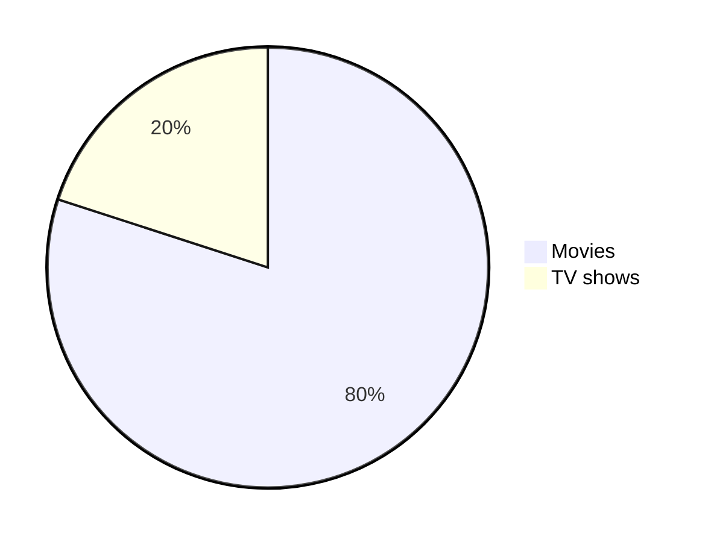
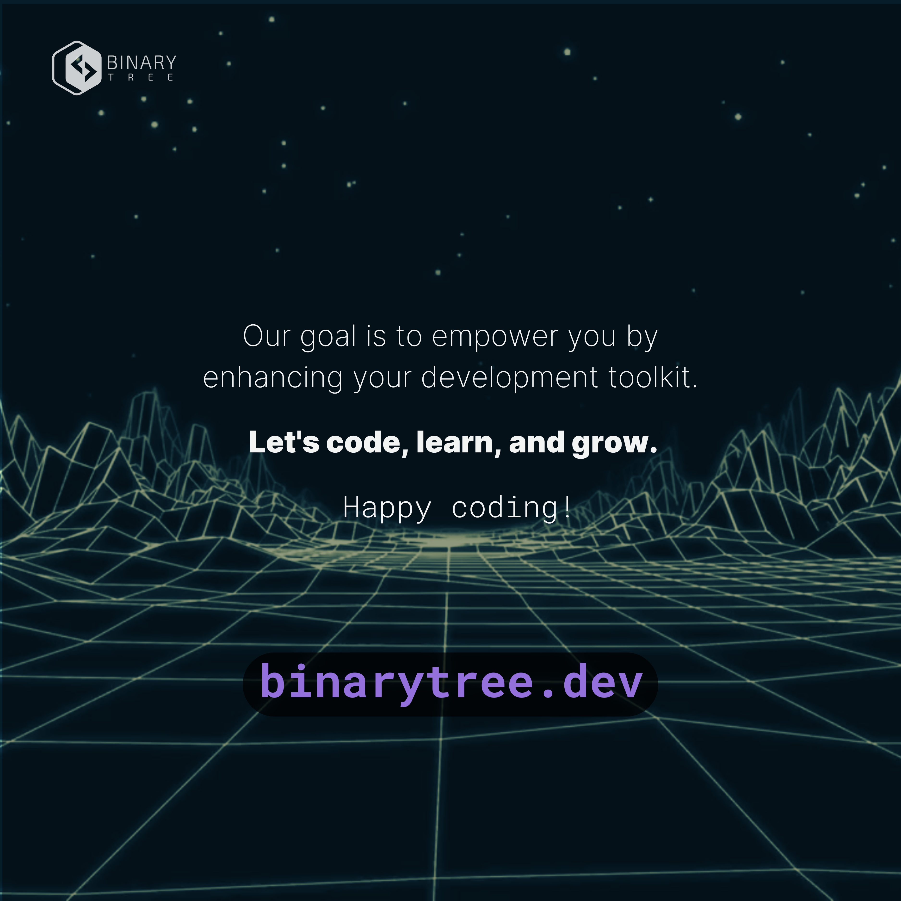
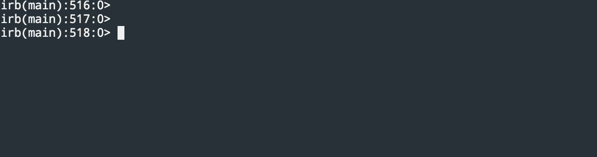

<p align="center">✨Dvurechensky✨</p>

# Поддерживаемые расширения файлов в Markdown

|*| Тип содержимого | Поддерживаемые расширения                                              | Описание                                      |
|--|--------------|-------------------------------------------------------------------------|------------------------------------------------|
|✅| mermaid      | [.mermaid](./Files/pie_chart.mermaid), [.mmd](./Files/pie_chart.mmd)                | Инструмент для построения диаграмм и графиков |
|❌| geoJSON      | [.geojson](./Files/fictional_park.geojson), [.json](./Files/fictional_park.json)    | Формат для кодирования географических данных  |
|❌| topoJSON     | [.topojson](./Files/fictional_park.topojson), .json                           | Расширение GeoJSON для топологических данных  |
|❌| STL          | [.stl](./Files/solid_cube.stl)                                                | Формат файлов для 3D-моделей                  |
|✅| Markdown     | [.markdown](./Files/documentation.markdown), [.md](./Files/documentation.md)        | Язык разметки для форматирования текста       |
|✅| SVG          | [.svg](./Files/theultimatemarkdowncheatsheet-brightgreen.svg)                 | Формат файлов масштабируемой векторной графики|
|✅| PNG          | [.png](./Files/BinaryTree.png)                                                | Формат файлов портативной сетевой графики     |
|✅| GIF          | [.gif](./Files/ruby.gif)                                                      | Формат обмена графическими файлами            |
|✅| JPEG         | [.jpg](./Files/BinaryTree.jpg), .jpeg                                         | Формат файлов изображений JPEG                |
|✅| Text         | [.txt](./Files/todo.txt)                                                      | Обычный текстовый файл                        |

## mermaid ✅



````md

````

## ❌ geoJSON ❌

```geojson
{
    "type": "FeatureCollection",
    "features": [
      {
        "type": "Feature",
        "geometry": {
          "type": "Polygon",
          "coordinates": [
            [
              [-100.0, 40.0],
              [-99.0, 40.0],
              [-99.0, 41.0],
              [-100.0, 41.0],
              [-100.0, 40.0]
            ]
          ]
        },
        "properties": {
          "name": "Fictional Park",
          "description": "A large, fictional park for demonstration purposes."
        }
      }
    ]
  }
```

````md
```geojson
{
    "type": "FeatureCollection",
    "features": [
      {
        "type": "Feature",
        "geometry": {
          "type": "Polygon",
          "coordinates": [
            [
              [-100.0, 40.0],
              [-99.0, 40.0],
              [-99.0, 41.0],
              [-100.0, 41.0],
              [-100.0, 40.0]
            ]
          ]
        },
        "properties": {
          "name": "Fictional Park",
          "description": "A large, fictional park for demonstration purposes."
        }
      }
    ]
  }
```
````

## ❌ topoJSON ❌

```topojson
{
  "type": "Topology",
  "objects": {
    "fictional_park": {
      "type": "GeometryCollection",
      "geometries": [
        {
          "type": "Polygon",
          "arcs": [[0]],
          "properties": {
            "name": "Fictional Park",
            "description": "A large, fictional park for demonstration purposes."
          }
        }
      ]
    }
  },
  "arcs": [
    [[-100, 40], [-99, 40], [-99, 41], [-100, 41], [-100, 40]]
  ],
  "transform": {
    "scale": [0.0001, 0.0001],
    "translate": [-100, 40]
  }
}
```

````md
```topojson
{
  "type": "Topology",
  "objects": {
    "fictional_park": {
      "type": "GeometryCollection",
      "geometries": [
        {
          "type": "Polygon",
          "arcs": [[0]],
          "properties": {
            "name": "Fictional Park",
            "description": "A large, fictional park for demonstration purposes."
          }
        }
      ]
    }
  },
  "arcs": [
    [[-100, 40], [-99, 40], [-99, 41], [-100, 41], [-100, 40]]
  ],
  "transform": {
    "scale": [0.0001, 0.0001],
    "translate": [-100, 40]
  }
}
```
````

## ❌ STL ❌

```stl
solid cube
  facet normal 0 0 0
    outer loop
      vertex 0 0 0
      vertex 1 0 0
      vertex 1 1 0
    endloop
  endfacet
  facet normal 0 0 0
    outer loop
      vertex 0 0 0
      vertex 1 1 0
      vertex 0 1 0
    endloop
  endfacet
  facet normal 0 0 0
    outer loop
      vertex 0 0 1
      vertex 1 0 1
      vertex 1 1 1
    endloop
  endfacet
  facet normal 0 0 0
    outer loop
      vertex 0 0 1
      vertex 1 1 1
      vertex 0 1 1
    endloop
  endfacet
  facet normal 0 0 0
    outer loop
      vertex 0 0 0
      vertex 0 1 0
      vertex 0 1 1
    endloop
  endfacet
  facet normal 0 0 0
    outer loop
      vertex 0 0 0
      vertex 0 1 1
      vertex 0 0 1
    endloop
  endfacet
  facet normal 0 0 0
    outer loop
      vertex 1 0 0
      vertex 1 1 0
      vertex 1 1 1
    endloop
  endfacet
  facet normal 0 0 0
    outer loop
      vertex 1 0 0
      vertex 1 1 1
      vertex 1 0 1
    endloop
  endfacet
  facet normal 0 0 0
    outer loop
      vertex 0 0 0
      vertex 0 0 1
      vertex 1 0 1
    endloop
  endfacet
  facet normal 0 0 0
    outer loop
      vertex 0 0 0
      vertex 1 0 1
      vertex 1 0 0
    endloop
  endfacet
  facet normal 0 0 0
    outer loop
      vertex 0 1 0
      vertex 0 1 1
      vertex 1 1 1
    endloop
  endfacet
  facet normal 0 0 0
    outer loop
      vertex 0 1 0
      vertex 1 1 1
      vertex 1 1 0
    endloop
  endfacet
endsolid cube
```

````md
```stl
solid cube
  facet normal 0 0 0
    outer loop
      vertex 0 0 0
      vertex 1 0 0
      vertex 1 1 0
    endloop
  endfacet
  facet normal 0 0 0
    outer loop
      vertex 0 0 0
      vertex 1 1 0
      vertex 0 1 0
    endloop
  endfacet
  facet normal 0 0 0
    outer loop
      vertex 0 0 1
      vertex 1 0 1
      vertex 1 1 1
    endloop
  endfacet
  facet normal 0 0 0
    outer loop
      vertex 0 0 1
      vertex 1 1 1
      vertex 0 1 1
    endloop
  endfacet
  facet normal 0 0 0
    outer loop
      vertex 0 0 0
      vertex 0 1 0
      vertex 0 1 1
    endloop
  endfacet
  facet normal 0 0 0
    outer loop
      vertex 0 0 0
      vertex 0 1 1
      vertex 0 0 1
    endloop
  endfacet
  facet normal 0 0 0
    outer loop
      vertex 1 0 0
      vertex 1 1 0
      vertex 1 1 1
    endloop
  endfacet
  facet normal 0 0 0
    outer loop
      vertex 1 0 0
      vertex 1 1 1
      vertex 1 0 1
    endloop
  endfacet
  facet normal 0 0 0
    outer loop
      vertex 0 0 0
      vertex 0 0 1
      vertex 1 0 1
    endloop
  endfacet
  facet normal 0 0 0
    outer loop
      vertex 0 0 0
      vertex 1 0 1
      vertex 1 0 0
    endloop
  endfacet
  facet normal 0 0 0
    outer loop
      vertex 0 1 0
      vertex 0 1 1
      vertex 1 1 1
    endloop
  endfacet
  facet normal 0 0 0
    outer loop
      vertex 0 1 0
      vertex 1 1 1
      vertex 1 1 0
    endloop
  endfacet
endsolid cube
```
````

## Markdown ✅

**It works.**

```md
**It works.**
```

## SVG ✅


```md

```

## PNG ✅



```md

```

## GIF ✅



```md

```

## JPEG ✅


```md

```

## Text ✅

```txt
[x] Task 1
[] Task 2
```

````md
```txt
[x] Task 1
[] Task 2
```
````

<p align="center">✨Dvurechensky✨</p>